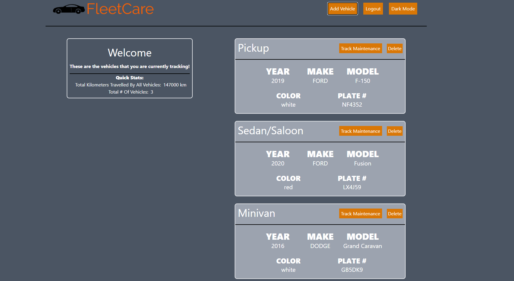

# [View The Live Site For FleetCare!](https://fleetcare.herokuapp.com/)  

* Please note! This website was hosted on Heroku. Please give a few seconds for the website to load!<br>
* View the front end [here](https://github.com/echen12/FleetCare-FrontEnd)
* view the JSON API [here](https://fleetcare.herokuapp.com/api/vehicle-info)

***

## Brief Description
**Welcome to FleetCare, a MERN SPA for all your vehicle needs!**
***
## Purpose
**Business owners and logistic companies need a way of tracking their vehicles to prolong the life of their investments. This applications tracks vehicles, mileage, warranty information and oil life to mantain vehicular upkeep.**
***

## Table of Contents
1. [Technology Used](#technology-used)
2. [Installations](#installations)
3. [Feature Code](#feature-code)
4. [Future Implementations](#future-implementations)
***

## Technologies Used
* MongoDB
* Express
* React
* Node
* [NHTSA Vehicle API](https://vpic.nhtsa.dot.gov/api/)
* Tailwind CSS
* Heroku
* MongoDB Atlas
***

## Installations
```
npm craco
npm axios
npm date-fns
npm moment
npm react-dom
npm react-modal 
npm react-router-dom
npm express
npm cors
npm dotenv
npm mongoose
npm nodemon
```
***
## Feature Code

* Inputting the vehicle identification number (VIN) sends a GET request to the [NHTSA API](https://vpic.nhtsa.dot.gov/api/)  and the vehicle make, model and year are decoded from it. Every vehicle has a unique VIN so this makes identifying any vehicle easy. User confirmation ensures that the vehicle information is correct before submission.


* After user confirmation, RESTful API commands pulls all the vehicle information from MongoDB and JS map functions create individual vehicle information cards. From here, the user can either delete or track the information of each vehicle.


* When the user updates the mileage, the date of the update is automatically determined and stored to MongoDB. The history mileage is also called from MongoDB to allow the user to view the mileage progression.

* When the user adds an oil change record, the oil life gets initialized to 100% and every mileage update calculates the oil life based on the oil change interval. After the current mileage exceeds the interval, the user is recommended to change the oil. This also updates the mileage tracker.

***

## Future Implementations

* User authentication with Passport
* Mapbox location tracking
* Dark/Light Mode
* Code splitting for performance enhancements


